# Deplyo

Para este punto vamos desplegar (Deploy) nuestra aplicacion en ISS desde nuestra Pc y desde un servidor gratiuto. Si bien Amazon web services tiene muy servicos y opciones, no es completamente gratuito. Por lo menos la base de datos tendremos que pagarlo.

Comencemos con configurar nuestra PC para poder desplegar nuestra aplicacion en un servidor IIS.

## Activacion y configuracion servidor IIS

Para comenzar a configurar vamos a entrar en **Panel de control**, luego en la seccion de **Programas** vamos a dirigirnos a **Programas y caracteristicas.** En la opcion de **Activar o desactivar las caracteristicas de Windows.**

Vamos a ir a buscar la caracteristica de Internert information services y vamos a checkearla. Por defecto nos dara algunas caracteristica, a parte de ella te dejo una fotos con las opciones que deberias agregar

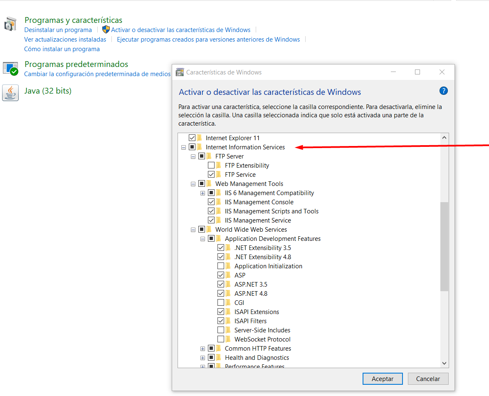

Luego de aceptar se va a buscar los archivos neceasarios para funcionar. Al terminar vamos a escribir en nuestro buscador de Windows IIS y vamos a cliclear la aplicacion llamada **Administracion de Internet Information Services.** 

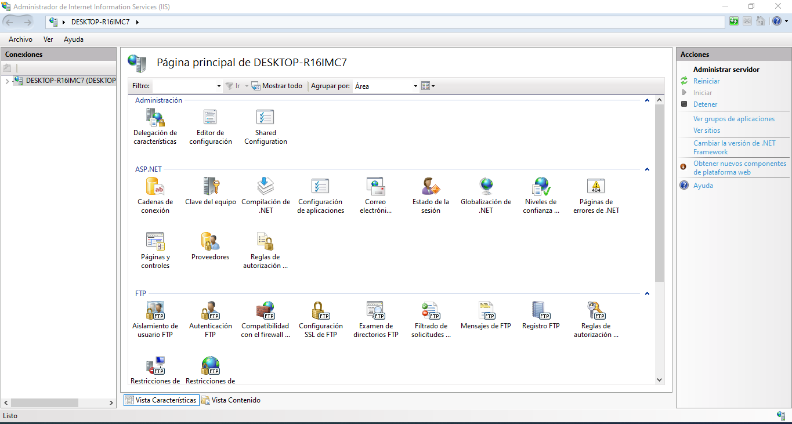

Una forma de saber si esta funcionando correctamente es que si escribimos en nuestro navegador preferido localhost solamente nos va a salir la siguiente pantalla,

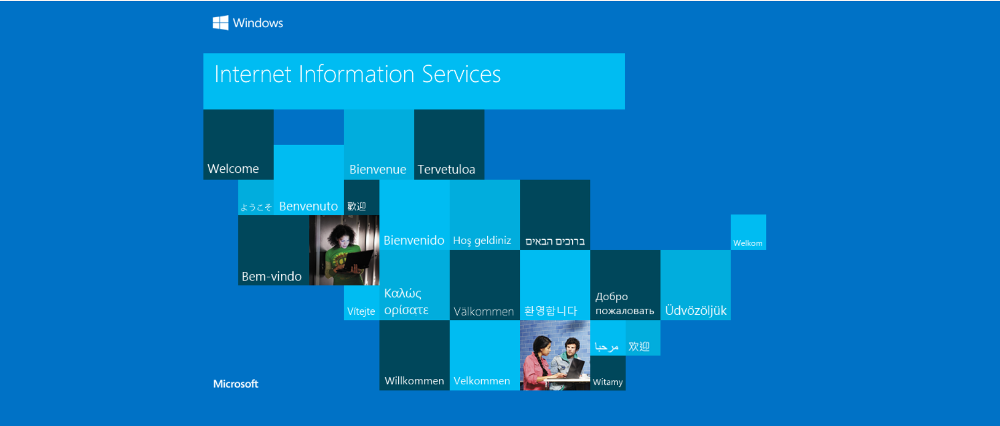

lo primero que quiero remarcar es que no voy a tocar nada relacioando a la creacion de una cuenta. Si tienes dudas puedes ver en Youtube, el proceso para crear una cuenta.

Como no es posible saber la configuraciones de cada pc, voy a dejar en claro que dependiendo de cada uno puede que les salga distintos errores, para evitar algunos voy a dejar la configuracion basica que tengo.

>Nota: En mi caso me salio este Error y se soluciono entrando a configuracion basica y cambiando el "Modo Canalizacion administrada" de integrado a clásico.

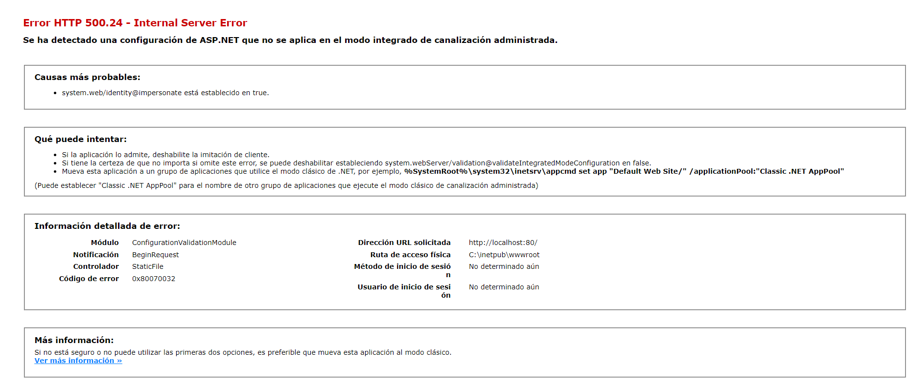

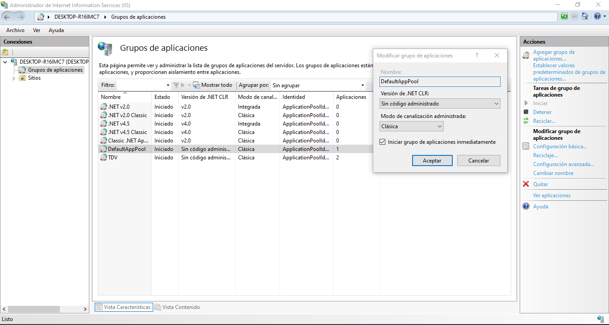

## Preparando distribucion publicada de nuestra aplicacion

El comando dotnet publish toma tu proyecto de C# y crea una distribución lista para ser desplegada en una máquina de destino. Esta distribución incluye todos los archivos y dependencias necesarios para ejecutar la aplicación de manera independiente sin necesidad de tener el SDK de .NET instalado en la máquina de destino. Esto es lo que se genera cuando usas dotnet publish:

- Directorio de publicación: Se crea un directorio en la ubicación especificada (por defecto, en la carpeta bin/Release/netcoreappX.Y/publish) que contiene todos los archivos necesarios para ejecutar la aplicación.

- Archivos ejecutables: Se incluye el archivo ejecutable de la aplicación, que suele ser un archivo con extensión .dll o .exe, dependiendo del tipo de proyecto y el sistema operativo de destino.

- Bibliotecas y dependencias: Se copian todas las bibliotecas y dependencias necesarias para que la aplicación se ejecute correctamente. Estas bibliotecas suelen ubicarse en una carpeta llamada lib.

- Archivos de configuración: Se incluyen archivos de configuración necesarios, como archivos de configuración de aplicación (appsettings.json o app.config) si los utilizas en tu proyecto.

- Archivos de recursos: Si tu aplicación utiliza archivos de recursos como imágenes, archivos de texto u otros recursos, estos se incluirán en la carpeta de recursos.

- Archivos de vistas (si es una aplicación web): En el caso de aplicaciones web ASP.NET, las vistas y los archivos relacionados se copian en la carpeta de vistas.

- Archivos estáticos (si es una aplicación web): Los archivos estáticos, como archivos CSS, JavaScript, imágenes y otros recursos, se copian en la carpeta de contenido estático.

- Archivos de configuración específicos de la plataforma (si es necesario): Si tu aplicación está dirigida a diferentes plataformas (por ejemplo, Windows, Linux o macOS), es posible que se generen archivos de configuración específicos de la plataforma para ajustar el comportamiento de la aplicación en cada plataforma.

Para modo de ejemplo vamos a crear un distribucion en una carpeta publshi. 

    Dotnet publish -c release -o ./publish

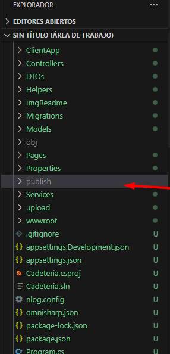

Al crearse la carpeta, lo unico que tenemos que hacer es copiar todo su contenido y pegarlo en una carpeta que se creo despues de activar la IIS llamada **inetpub** ubicada en C:\inetpub\wwwroot.

>Recordatorio: cada distribusion tiene que estar almacenado en su propia carpeta.

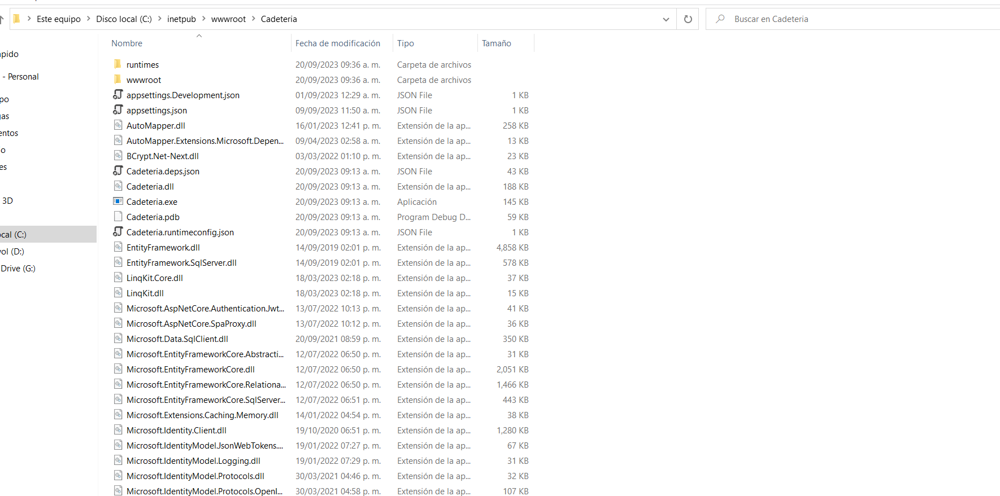

Como sabemos para que podamos comenzar a porgramar en C# necesitamos descargar el SDK. Pero para tener un hosting local IIS necesitamos tambien el complemento llamado ASP.NET Core Runtime de la version correspondiente. [Link](https://dotnet.microsoft.com/es-es/download/dotnet) para descargar

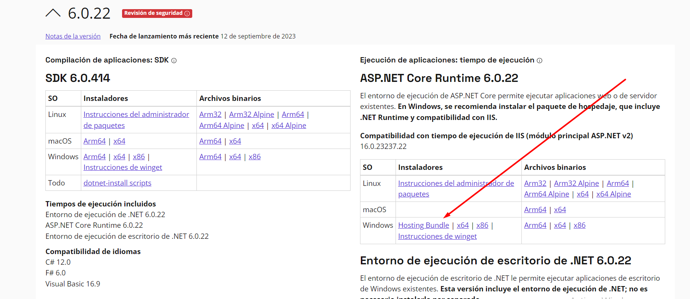

Despues de instalarlo solo tenemos que ir de nuevo a nuestro Administrador IIS y entrar en nuestro programa.
En la carpeta de sitio, colocamos la opcion de crear un sitio Nuevo y agregramos donde guardamos nuestro proyecto, colocamos un nuevo puerto que no fue usado y corremos nuestra aplicacion. de dos maneras

- hacemos click en examinar *:[pueto] (http)
- escribimos en nuestro navegador **localhost:(pueto)** o el **[Ip]:[pueto]

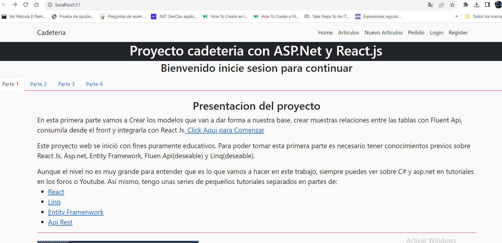

Gracias a esto, podremos abrir nuestra aplicacion en cualquier dispositivo que comparta la misma red. por ejemplo otra computadora, un celular o una tablet

Aunque en estos ultimos puede tardar demaciado.

## Publicar en un hosting gratuito.

Para este caso vamos a usar [Smarter.net](https://www.smarterasp.net/). Lo primero es bastante simple, tenemos que crear nuestra cuenta gratiuta de 60, de la cual recomiendo usar un Gmail nuevo, no asocie el Gmail personal para este tipo de prueba.

Una vez creado verificamos la cuenta en nuestro correo electronico el cual nos redireccionara a la pagia para loguear. Luego acemos click en intentar ahora(Try Now) y nos redireccionara a un formularios relacionado con los datos de hosting.

>Nota: como es una version gratiuita para pruebas, puede poner la misma contraeña que la de su login, pero es recomensable tener una contraseña fuerte y que pueda recordar.

Al final nos aparecera el resumen pidiendonos que esperemos.

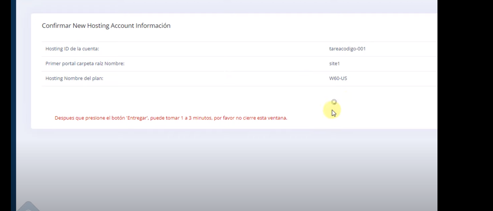

Una vez adentro vamos a crear nuestra base de datos. Para ello vamos a entrar a la opcion de ingresar al pc, luego selecionaremos la base de datos que estamos usando. En nuestro caso estamos conectandonos a MSSQL(SQL Management) Luego seleccionaremos la version que tenemos instalada, le damos un nombre y una contraseña Despues de eso podemos enviar.

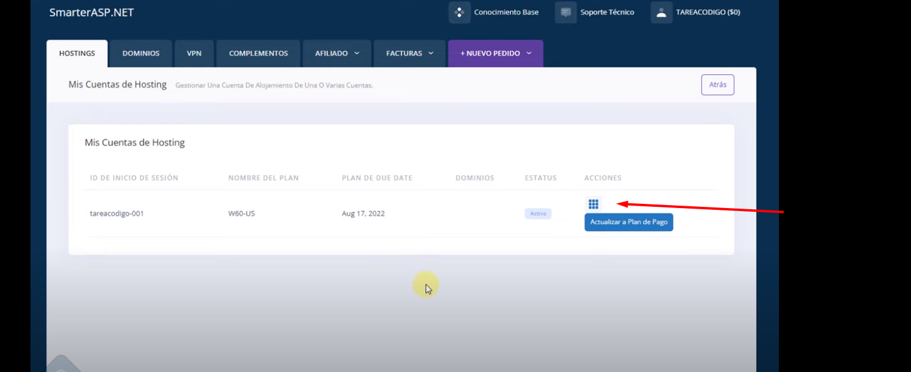
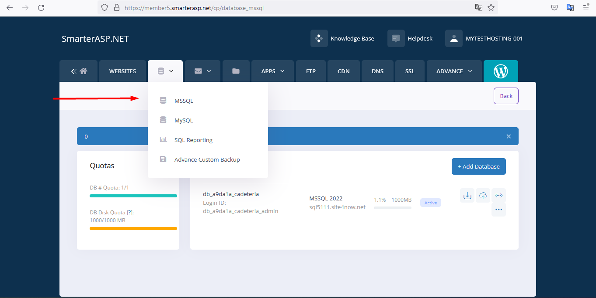

Una vez terminado vamos a obtener la cadena de conexion. Con esta cadena podremos conectar nuestro SQL Management con la base de datos del hosting.

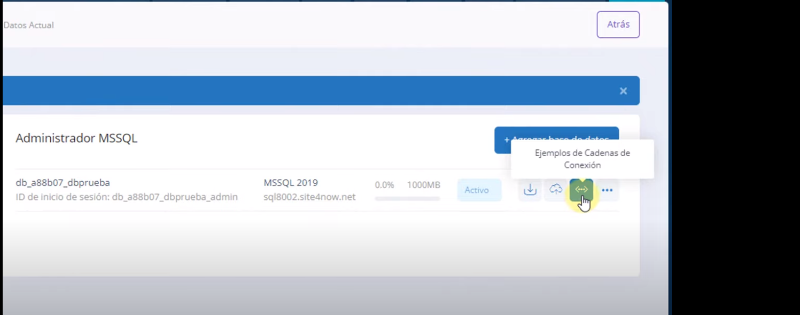
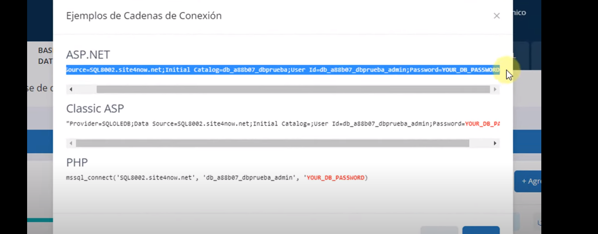

En SQL Management vamos a establecer una nueva conexion y para ello vamos a usar la cadena que nos proporciona el hosting

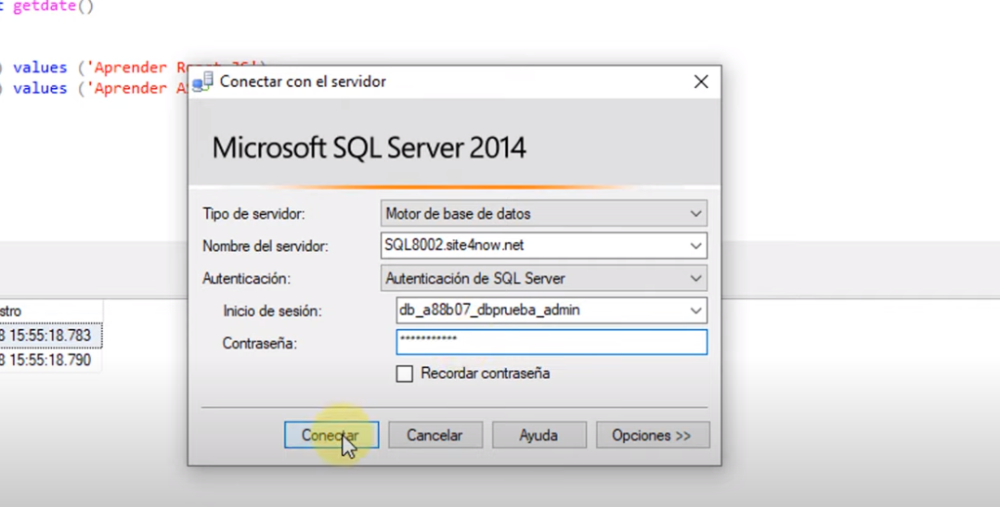

- Data source = Nombre de usuairo.
- User Id = inicio de session.
- Password = Contranseña que creamos anteriormente paa nuestra base de datos, esta no aparece por motivos de seguridad.

Si todo va bien se creara, no nos equivocamos de version y escribimos todo correctamente, se creara una nueva instancia en nuestro SQL Management. En este lugar se vera que nuestra DB esta vacia, por lo que tenemos que crearla. 

Por lo general podemos crearla una generando nuevas consultas con una estructura parecida a esta.

    CREATE TABLE #MyTempTable (
        col1 INT PRIMARY KEY
    );

    INSERT INTO #MyTempTable
    VALUES (1);

Pero nosotros hicimos uso de EF para crear las base de datos, por lo que tenemos una carpeta con las migraciones necesarias para automatizar este proceso.

Lo unico que tenemos que hacer es escribir la cadena de conexion que nos brinda el hosting en nuestro archivo **appsettings.json** y despues de subir la base de datos con el comando **dotnet ef database update** si todo esta correctamente escrito nuestra base de datos estara cargada con los datos de pruebas que inicializamos al inicio.

Ahora Solo nos queda el paso final, Vamos a la carpeta donde se creo nuestra distribucion y remplazamos nuestro archivo **appsettings.json**.

>Nota: no estoy hablando de la carpeta relacionada con la administracion IIS. si cambia esto la aplicacion podria fallar.

Vamos al archivo web.config y cambiamos **stdoutLogEnabled** Esto nos proporcionara un Log sensillo que nos dara algunas pistas si nuestro programa anda mal o tiene errores de conexion.

>Tambien pueden obtar por crear sus porpios Log con la aplicacion Nlog.

Ahora comprimimos todo y nos vamos a la pagina de nuestro Hosting. entramos en la pestama con el lgo de una carpeta subimos el archivo y lo descomprimimos en la carpeta que nos recomienda.

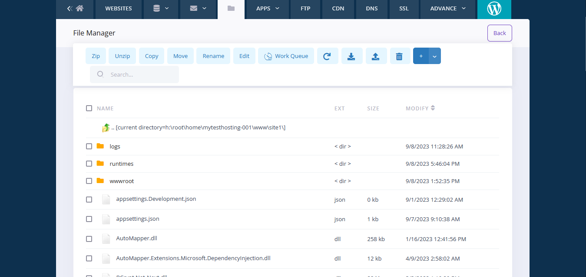

Luego si queremos podemos borrar el comprimido. volvemos a la pestaña de web site y hacemos click en la direccion de nuestro sitio web.

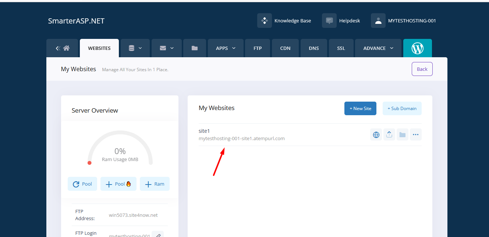
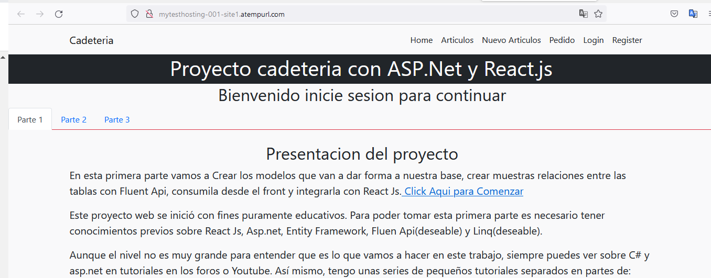

Con esto nuestra pagina fue desplegada con exito. Claro que el sitio web nos mostrara que no contamos con certificado, pero eso es otro tema para otro tutorial.

#### Felicidades por llegar hasta aqui. Como sabran todavia queda mucho por completar, pero recientemente me he puesto a pensar en la posibilidad de plantear los problemas futuros como un microservicio. Pero como no cuento con tanto tiempo por el momento. Nos vemos en otro tutorial.

